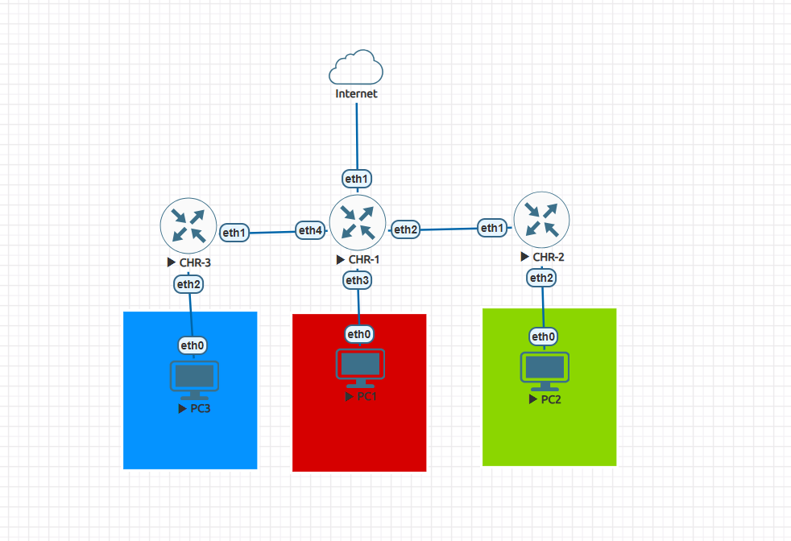

# MikroTik OSPF Multi Area with Passive Interface

## Overview
This project demonstrates the implementation of:
- Dynamic Routing using OSPF
- Multi Area OSPF
- Area Border Router (ABR)
- Passive Interface configuration

using MikroTik CHR RouterOS v6.

The topology uses:
- Area 0 as the backbone area
- Area 1 as a non-backbone area
- Passive Interface on all LAN interfaces

---

# Topology
